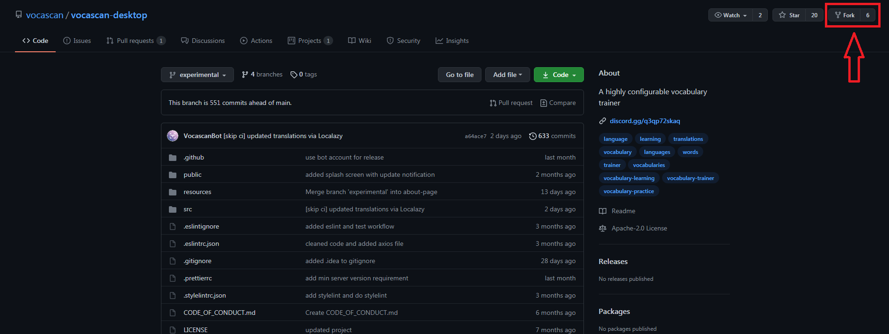

# How to contribute

## 1. Install vocascan-server

see the vocascan-server [installation guide](vocascan-server/installation/installation)

## 2. Forking

Fork the [vocascan-desktop](https://github.com/vocascan/vocascan-desktop) repository



## 3. Clone your fork

```bash
git clone https://github.com/<username>/vocasan-desktop.git
```

## 4. Checkout experimental

```bash
git checkout experimental
```

## 5. Create your own branch

```bash
git checkout -b my-awesome-feature
```

## 6. Install dependencies

```bash
npm install
```

## 7. Run in dev mode

```bash
npm run start
```

## 8. Add your awesome feature

## 9. Commit and push changes

```bash
git add .
git commit -m "added my awesome feature"
git push
```

## 10. Create an pull request

open `https://github.com/vocascan/vocascan-desktop/compare/experimental...[username]:my-awesome-feature` and press
`Create pull request`, fill out the template, make sure the `Allow edits and access to secrets by maintainers` checkbox
is checked and press again `Create pull request`. Now you're ready to wait for feedback from the maintainers.


