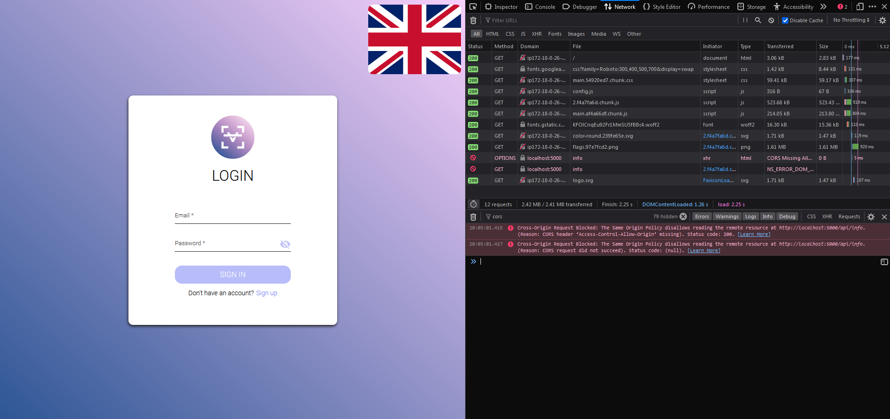

# Troubleshooting

## Cannot Login/Register

If you cannot login or register can be caused by multiple factors.

### Cors

If you try to connect your frontend to your server and they dont share the same domain, you can get CORS errors. To
check that, open the console and look for such errors:



To fix that add the cors option (`server.cors`) to your server configuration. E.g.:

```js
module.exports = {
  // ...
  server: {
    cors: "myfrontend.de",
  },
};
```

!> Setting cors to `*` is highly not recommended
