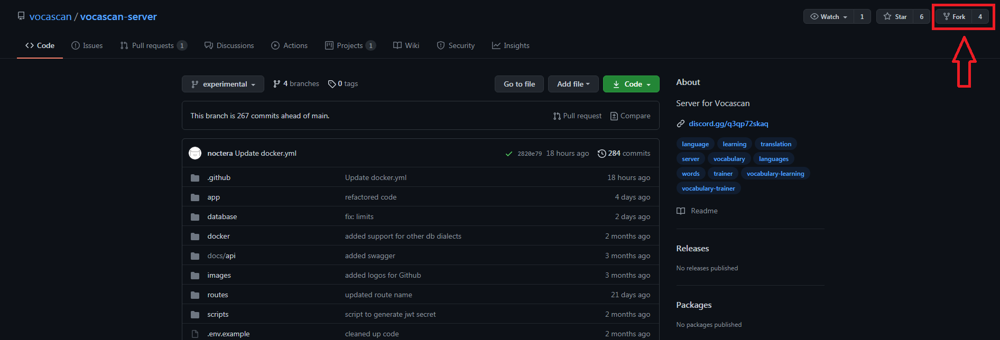
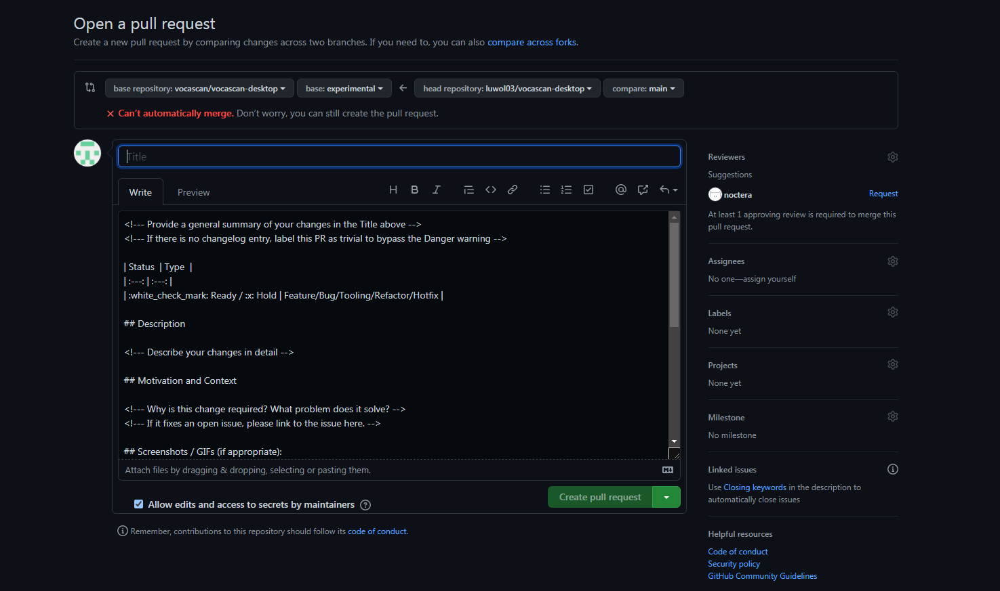

# How to contribute

## 1. Fork the&nbsp;[vocascan-server](https://github.com/vocascan/vocascan-server) repository



## 2. Clone your fork

```bash
git clone https://github.com/<username>/vocasan-server.git
```

## 3. Checkout experimental

```bash
git checkout experimental
```

## 4. Create your own branch

```bash
git checkout -b my-awesome-feature
```

## 5. Install dependencies

```bash
npm install --sqlite
```

## 6. Add config

Copy the env config file template to configure your server.

```bash
cp vocascan.config.example.js vocascan.config.js
```

Fill out the config file. For a complete guide for each option see [configuration](vocascan-server/configuration)

## 7. Run in dev mode

```bash
npm run dev
```

?> To use the [vocascan cli](vocascan-server/cli) run the command `npm run link`

## 8. Add your awesome feature

## 9. Commit and push changes

```bash
git add .
git commit -m "added my awesome feature"
git push
```

## 10. Create an pull request

    open <https://github.com/vocascan/vocascan-server/compare/experimental...[username>]:my-awesome-feature and press
    `Create pull request`, fill out the template, make sure the `Allow edits and access to secrets by maintainers`
    checkbox is checked and press again `Create pull request`. Now you're ready to wait for feedback from the
    maintainers.

    
